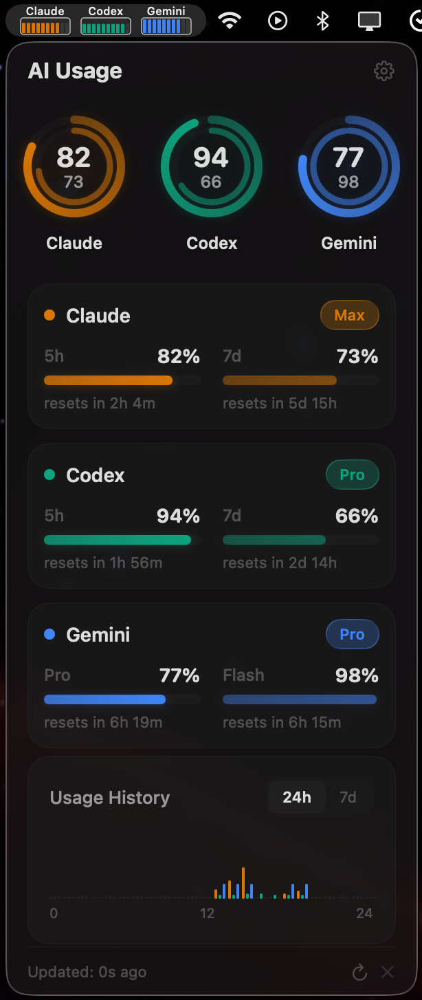
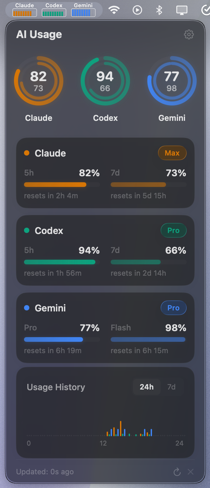

<div align="center">

# AI Usage Monitor

**Real-time AI service quota tracker for your macOS menu bar.**

Keep tabs on Claude, Codex, and Gemini usage without leaving your workflow.

[](https://www.apple.com/macos/)
[](https://swift.org)
[](LICENSE)
[](../../releases)

<br>


&nbsp;&nbsp;&nbsp;


</div>

<br>

## Features

- **Menu Bar at a Glance** &mdash; Per-service bar charts show remaining quota directly in the menu bar
- **Circular Gauges** &mdash; Animated dual-ring gauges: outer ring for short-term, inner for long-term quota
- **Detailed Breakdown** &mdash; Remaining percentage, reset countdown, and plan tier for each service
- **Usage History** &mdash; 24-hour and 7-day usage charts to spot trends
- **Auto Refresh** &mdash; Configurable polling interval (1m / 5m / 15m / 30m)
- **macOS Native** &mdash; Built with SwiftUI and Liquid Glass on macOS Tahoe
- **10 Languages** &mdash; English, Korean, Japanese, Chinese, Spanish, French, German, Portuguese, Russian, Italian

## Supported Services

| Service | Auth Method | Metrics |
|---------|------------|---------|
| **Claude** | OAuth via Claude Code Keychain | 5-hour window, 7-day window, plan tier |
| **Codex** | OAuth via Codex CLI Keychain | 5-hour window, 7-day window, plan tier |
| **Gemini** | OAuth via `~/.gemini/oauth_creds.json` | Pro quota, Flash quota, reset times |

## Install

### Download

Grab the latest `.dmg` from the [Releases](../../releases) page.

### Manual

1. Open the DMG and drag **AI Usage Monitor** to Applications
2. First launch: **Right-click** the app &rarr; **Open** (required for unsigned apps)

### Build from Source

```bash
git clone https://github.com/multi-turn/ai-usage-monitor.git
cd ai-usage-monitor
swift build
.build/debug/AIUsageMonitor
```

> Requires Xcode 16+ and macOS 26.0 (Tahoe) SDK.

## How It Works

AI Usage Monitor reads existing OAuth credentials from your local CLI tools. **No API keys or passwords are stored by the app.**

| Service | Credential Source |
|---------|-----------------|
| Claude | macOS Keychain (`Claude Code-credentials`) |
| Codex | macOS Keychain (`Codex-credentials`) |
| Gemini | `~/.gemini/oauth_creds.json` + auto token refresh |

The app queries each provider's usage/quota API and displays the results. Token refresh is handled automatically.

## Requirements

- macOS 26.0 (Tahoe) or later
- At least one of: [Claude Code](https://claude.ai/code), [Codex CLI](https://openai.com/codex), or [Gemini CLI](https://ai.google.dev/gemini-api/docs/gemini-cli) installed and authenticated

## License

[MIT](LICENSE)
